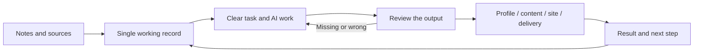

# Working with AI — An Operating System

**Describe a real job to an AI, execute it, verify the output, and hand it off.**

A Turkish-language process guide distilled from Alperen Kayalar's practice on **September 8, 2026** and the three or four preceding days. The aim: another person can reproduce the same work professionally with their own accounts and data. First version: **v0.1 · September 9, 2026**; experience slice ends September 8. Current version: **v0.1.1 · September 25, 2026** ([changelog](CHANGELOG.md), Turkish).

> This system meaningfully simplified my work and my life. Here we show how we set it up, where we made mistakes, and which parts you can carry into your own work.

This is one person's experience — not a guarantee of speed or income. Time saved has not been benchmarked. The goal is to leave you with an output you can audit and a record that tells you where to start tomorrow.

**English readers: this file is a working translation of [README.md](README.md).** All internal links point to Turkish documents; translations are staged progressively — see the roadmap at the bottom.

---

## See the real process first, then reproduce it

1. Read [what we did on September 8](rehber/03-gercek-deneyim.md) *(Turkish)*: kickoff, human decisions, agent handoffs, execution, review, and the places where we got stuck.
2. Use the [reproduction protocol](rehber/07-tekrar-edilebilir-protokol.md) *(Turkish)*: every step names its input, owner, output, and acceptance criterion.
3. Open the [worked example](ornekler/prova/akisin-tamami.md) *(Turkish)*; produce the same records for your own narrowly-scoped job.

**Real experience**, **the standard extracted from that experience**, and **the fictional walkthrough** are labeled separately. The first real external-user application has not happened yet; the professional-reproducibility claim will be tested with that pilot. This first version stays at a level individuals and small teams can apply.

---

## Start with a small exercise

You can start with an AI chat and a folder you can save files to. The first exercise requires no new platform accounts, API keys, or automation.

1. Open the [getting-started guide](rehber/01-baslangic.md).
2. Give the AI [the fictional demo input](ornekler/ilk-demo/girdi.md) and [the first command](komutlar/README.md).
3. Compare the output to the [reference result](ornekler/ilk-demo/beklenen-cikti.md).
4. Do the same with your own shareable information; save your [master profile](sablonlar/ana-profil.md) and [closing note](sablonlar/kapanis.md).

**Done criterion:** one master profile, two purpose-fit texts, a list of claims without evidence, and a single next step.

---

## How the system works

This is the simplified view. The full method also records scope, human decisions, task splits, and the fallback path when something fails. Each tool is evaluated by the role it takes on in the job.

---

## What's in the pack?

| What you need | File to open |
|---|---|
| Reproduce the real process with someone else | [Application protocol](rehber/07-tekrar-edilebilir-protokol.md) · [Full walkthrough](ornekler/prova/akisin-tamami.md) |
| Do the initial setup | [Getting started](rehber/01-baslangic.md) |
| Understand the whole system | [System map](rehber/02-sistem-haritasi.md) |
| See today's real experience | [Setup lessons](rehber/03-gercek-deneyim.md) |
| Organize accounts, content, news, and ads work | [Platforms](rehber/04-platformlar.md) |
| Bind open Chrome helpers to specific work | [Task split across seven tools](rehber/08-chrome-yardimcilari.md) · [Task card](sablonlar/yardimci-gorev-karti.md) |
| Use the same method across different jobs | [Workflows](rehber/05-is-akislari.md) |
| Add Codex and connections when needed | [Tool and connection setup](rehber/06-arac-ve-baglanti.md) |
| Apply the protocol with Claude Code and current Claude models | [Working with Claude](rehber/09-claude-ile-uygulama.md) · [Draft skills](.claude/skills/) |
| Copy and fill in | [Templates](sablonlar/README.md) · [Single-file work record](sablonlar/is-kaydi.md) · [Commands](komutlar/README.md) |
| Apply it on a livestream | [60-minute stream](yayin/01-ilk-yayin.md) · [Series and short content](yayin/02-seri-ve-kisa-icerikler.md) |
| Check sources and limits | [Sources](KAYNAKLAR.md) |
| See how the pack was verified | [Verification](DOGRULAMA.md) · [Check script](araclar/kontrol.py) |
| Share the pack, report your own reproduction | [Publishing note](YAYINLAMA.md) · [Open a reproduction report](https://github.com/AlperenKayalar/ai-ile-calisma-duzeni/issues/new?template=tekrar-raporu.md) |

---

## Difference between the real experience and the demo

While preparing this version, we reviewed local working records, account-completion results, and the current setup baseline. The last record contains **31 account entries across 30 distinct account platforms and 11 tool sites**, totaling **41 distinct sites**. That number does not mean 41 working integrations. The separate bookmark selection of **85 tools/platforms** is also not a count of products actually used.

The records include profile adaptation, reusing the same portfolio work across different channels, a local working dashboard, tracking, and verification examples. Each item's completion level is documented in the [experience section](rehber/03-gercek-deneyim.md).

The characters Deniz and Örnek Atölye in `ornekler/` are entirely fictional. The templates were rewritten for this pack. Private account exports, raw chat archives, and personal configurations were not copied into the pack.

---

## The first professional reproduction

Stage one: a single job with existing resources and a clear acceptance criterion. After you apply the job, try the same records with a second person; note where extra explanation is needed and which step stalls. Once a job becomes routine, add a connection or automation. The question to ask before adding a new tool: **Which step will it take on, and how will I verify its output?**

---

## Roadmap

- **v0.1** (Sep 9, 2026) — First public version, Turkish
- **v0.1-en** (Sep 14, 2026) — This working English index
- **v0.1.1** (Sep 25, 2026) — Claude Code chapter and draft skills, prompt formatting for current models, single-file work record template, automated checks (Turkish)
- **v0.2** (planned) — First external-user pilot; document what actually reproduced vs. what stalled
- **v0.3** (planned) — Full English translation of `rehber/`, `sablonlar/`, and `komutlar/`

---

## License and contact

© 2026 Alperen Kayalar. The original guides, templates, command texts, fictional examples, and publishing texts in this pack are shared under the [Creative Commons Attribution 4.0 International](https://creativecommons.org/licenses/by/4.0/deed.en) license. With attribution and change disclosure, you can share and adapt — including commercially. External source content, third-party rights, and trademark/personality rights are outside this license. [Full license text](LICENSE) · [Contributing](CONTRIBUTING.md) · [Changelog](CHANGELOG.md).

Contact: [github.com/AlperenKayalar](https://github.com/AlperenKayalar) · [Orange Point Studios](https://orangepointstudio.com/)
