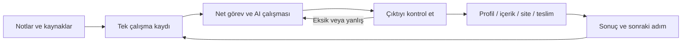

# AI ile Çalışma Düzeni

**Gerçek bir işi AI ile tarif et, uygula, doğrula ve devret.**

Alperen Kayalar'ın özellikle **8 Eylül 2026'daki konuşma ve uygulamalarından**, önceki üç dört günün bağlamıyla çıkarılan Türkçe süreç rehberi. Amaç, birlikte yürütülen işi başka bir kişinin kendi hesapları ve verileriyle profesyonel biçimde tekrar edebilmesi. İlk sürüm: **0.1 · 9 Eylül 2026**; deneyim kesiti 8 Eylül gün sonudur.

> Bu düzen işimi ve hayatımı ciddi biçimde kolaylaştırdı. Burada nasıl kurduğumuzu, nerede hata yaptığımızı ve hangi parçaları kendi işine taşıyabileceğini gösteriyoruz.

Bu kişisel deneyim bir hız veya gelir garantisi değil. Tasarruf edilen süre henüz karşılaştırmalı ölçülmedi. Rehberin hedefi, elinde kontrol edebileceğin bir çıktı ve ertesi gün nereden başlayacağını gösteren bir kayıt bırakmak.

## Önce gerçek süreci gör, sonra tekrar et

1. [8 Eylül'de ne yaptığımızı](rehber/03-gercek-deneyim.md) oku: başlangıç, insan kararları, ajanlara iş aktarımı, uygulama, kontrol ve tıkanmalar.
2. [Tekrar protokolünü](rehber/07-tekrar-edilebilir-protokol.md) kullan: her adımın girdisi, sorumlusu, çıktısı ve kabul ölçütü belli.
3. [Doldurulmuş provayı](ornekler/prova/akisin-tamami.md) aç; aynı kayıtları kendi dar kapsamlı işin için oluştur.

**Gerçek deneyim**, **bu deneyimden çıkarılan standart** ve **kurmaca prova** ayrı etiketlendi. İlk gerçek dış kullanıcı uygulaması henüz yapılmadı; profesyonel tekrar iddiası bu pilotla sınanacak. Anlatım bu ilk sürümde bireylerin ve küçük ekiplerin uygulayabileceği düzeyde tutuldu.

## Küçük alıştırmayla başla

Bir AI sohbeti ve dosya kaydedebildiğin bir klasörle başlayabilirsin. İlk alıştırma yeni platform hesabı, API anahtarı veya otomasyon gerektirmez.

1. [Başlangıç rehberini](rehber/01-baslangic.md) aç.
2. [Kurmaca demo girdisini](ornekler/ilk-demo/girdi.md) ve [ilk komutu](komutlar/README.md) AI'ya ver.
3. Çıktıyı [örnek sonuçla](ornekler/ilk-demo/beklenen-cikti.md) karşılaştır.
4. Aynı işlemi kendi paylaşılabilir bilgilerinle yap; [ana profilini](sablonlar/ana-profil.md) ve [kapanış notunu](sablonlar/kapanis.md) kaydet.

**Bitti ölçütü:** Bir ana profil, iki amaca uygun metin, dayanağı olmayan iddiaların listesi ve tek bir sonraki adım.

## Düzen nasıl çalışıyor?

Bu, deneyimin sadeleştirilmiş görünümüdür. Tam yöntemde kapsam, insan kararları, görev paylaşımı ve hata halinde devam yolu da kayıt altına alınır. Araçların her biri bu işte üstlendiği rolle değerlendirilir.

## Pakette ne var?

| İhtiyacın | Açılacak dosya |
|---|---|
| Gerçek iş sürecini başkasında tekrarlamak | [Uygulama protokolü](rehber/07-tekrar-edilebilir-protokol.md) · [Tam prova](ornekler/prova/akisin-tamami.md) |
| İlk kurulumu yapmak | [Başlangıç](rehber/01-baslangic.md) |
| Bütün düzeni anlamak | [Sistem haritası](rehber/02-sistem-haritasi.md) |
| Bugünkü gerçek deneyimi görmek | [Kurulumdan dersler](rehber/03-gercek-deneyim.md) |
| Hesap, içerik, haber ve reklam işlerini düzenlemek | [Platformlar](rehber/04-platformlar.md) |
| Chrome'da açık yardımcıları belirli işe bağlamak | [Yedi araçla görev paylaşımı](rehber/08-chrome-yardimcilari.md) · [Görev kartı](sablonlar/yardimci-gorev-karti.md) |
| Aynı yöntemi farklı işlerde kullanmak | [İş akışları](rehber/05-is-akislari.md) |
| Codex ve bağlantıları gerektiğinde eklemek | [Araç ve bağlantı kurulumu](rehber/06-arac-ve-baglanti.md) |
| Kopyalayıp doldurmak | [Şablonlar](sablonlar/README.md) · [Komutlar](komutlar/README.md) |
| Canlı yayında uygulamak | [60 dakikalık yayın](yayin/01-ilk-yayin.md) · [Seri ve kısa içerikler](yayin/02-seri-ve-kisa-icerikler.md) |
| Kaynak ve sınırları kontrol etmek | [Kaynaklar](KAYNAKLAR.md) |
| Paketin nasıl kontrol edildiğini görmek | [Doğrulama](DOGRULAMA.md) |
| GitHub yayınına hazırlamak | [Yayınlama notu](YAYINLAMA.md) |

## Gerçek deneyim ile demo arasındaki fark

Bu sürüm hazırlanırken yerel çalışma kayıtları, hesap tamamlama sonuçları ve mevcut kurulum kabulü incelendi. Son kayıtta **31 hesap kaydı, 30 ayrı hesap platformu ve 11 araç sitesi** bulunuyor; toplam **41 ayrı site**. Bu sayı 41 çalışan entegrasyon anlamına gelmiyor. Ayrı yer imi seçkisindeki **85 araç/platform** da denenmiş ürün sayısı değil.

Kayıtlar profil uyarlama, aynı portföy çalışmasını farklı kanallarda kullanma, yerel çalışma panosu, takip ve doğrulama örnekleri içeriyor. Her birinin tamamlanma düzeyi [deneyim bölümünde](rehber/03-gercek-deneyim.md) ayrı yazılı.

`ornekler/` içindeki Deniz ve Örnek Atölye tamamen kurmaca. Şablonlar bu paket için yeniden yazıldı. Özel hesap dökümleri, ham sohbet arşivleri ve kişisel yapılandırmalar pakete kopyalanmadı.

## İlk profesyonel tekrar

İlk aşama mevcut kaynakları olan tek bir iş ve açık bir kabul ölçütü. İşi uyguladıktan sonra aynı kayıtları ikinci bir kişiyle dene; nerede ek açıklama gerektiğini ve hangi adımın aksadığını kaydet. Düzenli yapılan bir iş oluşunca bağlantı veya otomasyon ekle. Yeni araç eklemek için sorulacak soru: **Hangi adımı üstlenecek, sonucunu nasıl kontrol edeceğim?**

© 2026 Alperen Kayalar. Bu paketin lisanslanabilir özgün rehberleri, şablonları, komut metinleri, kurmaca örnekleri ve yayın metinleri [Creative Commons Atıf 4.0 Uluslararası](https://creativecommons.org/licenses/by/4.0/deed.en) kapsamında paylaşılır. Atıf vererek ve değişiklikleri belirterek, ticari kullanım dahil paylaşabilir ve uyarlayabilirsin. Dış kaynak içerikleri, üçüncü taraf hakları ve marka/kişilik hakları bu lisansın kapsamında değildir. [Lisansın tam metni](LICENSE) · [Katkı biçimi](CONTRIBUTING.md) · [Sürüm geçmişi](CHANGELOG.md).
